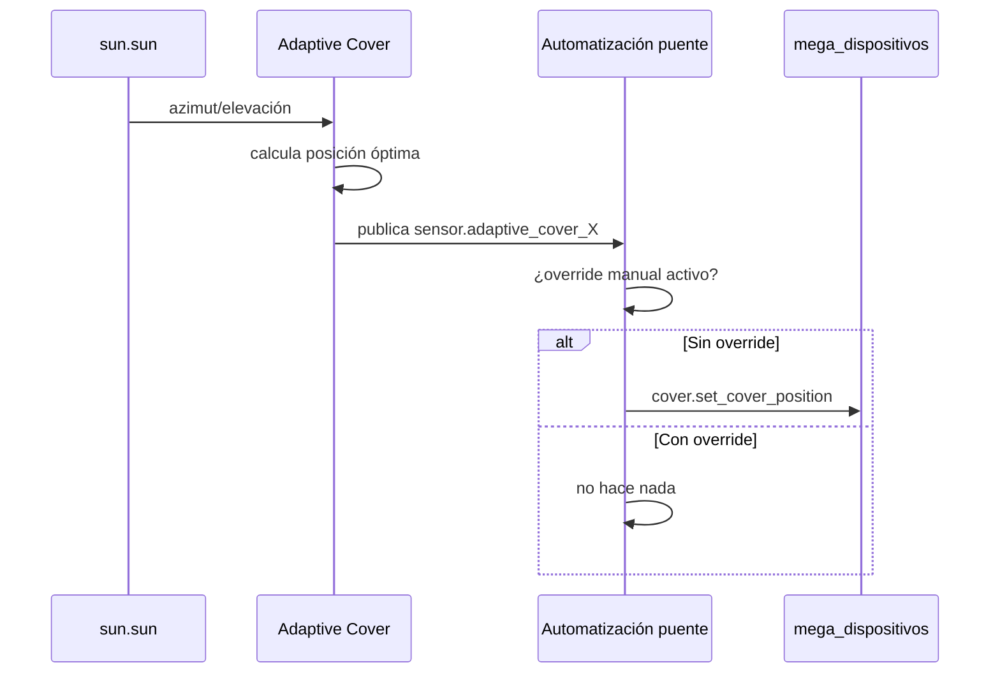

# Persianas que se ajustan solas según el sol: Adaptive Cover (HACS)

No es un blueprint de este repo, sino una **integración externa de
HA** (no Arduino/firmware) que calcula la posición óptima de cada
persiana para bloquear el sol directo, a partir de azimut/elevación
del sol (`sun.sun`) y la orientación de la fachada donde está esa
persiana.

Con la posición nativa de `mega_dispositivos` (firmware 1.6.0+), llama
directamente a `cover.set_cover_position` sobre la entidad `cover.*` —
mismo servicio que usan
[`persiana_pulsador_completo.yaml`](persiana-pulsador-completo.md) y
cualquier slider manual, sin ningún helper intermedio.

- Repo: [github.com/basbruss/adaptive-cover](https://github.com/basbruss/adaptive-cover)
- Se instala vía HACS (Ajustes → HACS → Integraciones → buscar
  "Adaptive Cover" → instalar → reiniciar HA), luego se añade como
  integración normal.

## Qué pide por persiana al configurarla

- **Orientación de la ventana/fachada** (azimut en grados, 0 = norte,
  90 = este, 180 = sur, 270 = oeste) — el dato clave.
- Opcional: alto y ancho de la ventana, distancia a la ventana del
  punto que quieres proteger del sol.
- Modo **blind** (persiana normal de subir/bajar, tu caso) frente a
  modo **venetian** (lamas orientables, no aplica aquí).

## Cómo conectarlo a lo que ya tienes



Puedes leer el sensor de "posición recomendada" y volcarlo a
`cover.set_cover_position` con una automatización corta:

```yaml
automation:
  - alias: Persiana Salón - seguir sol (Adaptive Cover)
    trigger:
      - platform: state
        entity_id: sensor.adaptive_cover_salon
    action:
      - service: cover.set_cover_position
        target:
          entity_id: cover.salon
        data:
          position: "{{ trigger.to_state.state | float(0) }}"
```

## ⚠️ Pendiente importante: no pisar un ajuste manual

Si dejas la persiana a mano en, p. ej., 10% (viendo una peli) y luego
Adaptive Cover recalcula y publica 35%, el puente tal cual la subiría
sin que lo pidieras.

**La solución no es comprobar si el objetivo ya se superó** (frágil).
Adaptive Cover trae detección de override manual incorporada — hay
que comprobar esa entidad de override antes de llamar a
`set_cover_position`:

```yaml
automation:
  - alias: Persiana Salón - seguir sol (Adaptive Cover)
    trigger:
      - platform: state
        entity_id: sensor.adaptive_cover_salon
    condition:
      - condition: state
        entity_id: switch.adaptive_cover_salon_override  # confirmar nombre real
        state: "off"
    action:
      - service: cover.set_cover_position
        target:
          entity_id: cover.salon
        data:
          position: "{{ trigger.to_state.state | float(0) }}"
```

!!! question "Pendiente"
    El `entity_id` exacto de la entidad de override depende de la
    versión instalada — confirmar al dar de alta la instancia real.

## Opcional: resetear el override cada mañana

```yaml
automation:
  - alias: Persiana Salón - reset override Adaptive Cover (7am)
    trigger:
      - platform: time
        at: "07:00:00"
    action:
      - service: switch.turn_off
        target:
          entity_id: switch.adaptive_cover_salon_override
```

Solo aplica si tu versión expone el override como un `switch`
controlable por servicio. Algunas versiones resetean el override solo
al pasar la persiana por un extremo — confirmar cuál tiene la
instancia real antes de crear esta automatización.

## Opcional: tener en cuenta el clima exterior

Pendiente de una estación meteorológica propia (viento, temperatura,
lluvia — marca/protocolo aún sin decidir). Dos usos distintos sobre el
mismo puente:

1. **Bloquear el ajuste solar cuando no tiene sentido** (nublado,
   frío) — misma mecánica que el override manual.
2. **Forzar cierre de seguridad por viento fuerte** — automatización
   aparte, con prioridad sobre cualquier otro control (incluido el
   override manual, porque aquí el motivo es proteger el hardware).

```yaml
automation:
  - alias: Persianas - cierre de seguridad por viento fuerte
    trigger:
      - platform: numeric_state
        entity_id: sensor.estacion_viento_kmh  # placeholder
        above: 50  # umbral a decidir
    action:
      - repeat:
          for_each: "{{ states.cover | map(attribute='entity_id') | list }}"
          sequence:
            - service: cover.close_cover
              target:
                entity_id: "{{ repeat.item }}"
```

## Nota

Cada persiana necesita su propia orientación de fachada, así que se
configura **una instancia de la integración por persiana** (o por
grupo de ventanas con la misma orientación).
