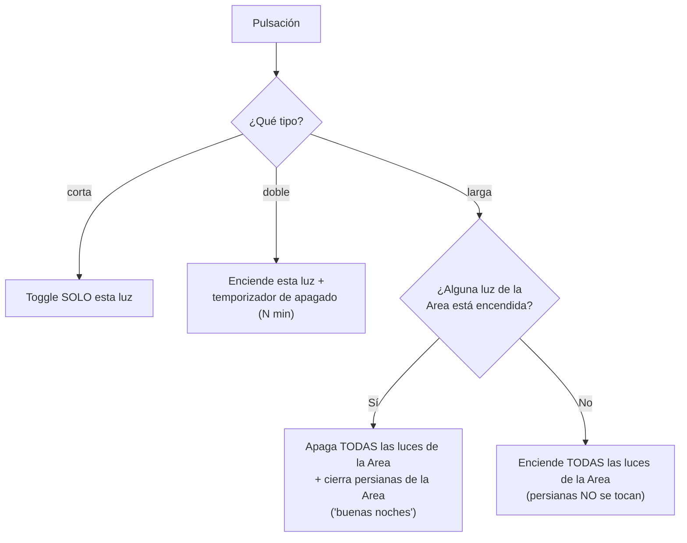

# `luz_pulsador.yaml`

Conecta un pulsador físico con una luz (`switch.*`, on/off simple —
las luces actuales no tienen control de brillo).

[:material-github: Ver el fichero en GitHub](https://github.com/GerardUmbert/arduino-mega-mqtt-ha/blob/master/home_assistant/blueprints/luz_pulsador.yaml){ .md-button }

!!! success "Compatible con ambos firmwares"
    Este blueprint usa solo corta/doble/larga — funciona igual tanto
    en [`mega_pulsadores`](../firmware/mega-pulsadores.md) (OneButton)
    como en
    [`mega_pulsadores_low_ram`](../firmware/mega-pulsadores-low-ram.md)
    (AceButton). El apagado automático usaba originalmente pulsación
    **triple**; se cambió a **doble** precisamente para que este
    blueprint funcionara en ambos firmwares sin distinción — ver
    [Changelog](../reference/changelog.md).

## Tabla de pulsaciones

| Pulsación | Efecto |
|---|---|
| corta | toggle on/off de esta luz (`light_entity`) |
| doble | enciende esta luz y programa apagado automático a los N minutos (configurable, 5 por defecto); volver a pulsar doble antes de que expire reinicia el temporizador |
| larga | toggle de TODAS las luces del Area de este pulsador (no solo `light_entity`): si alguna está encendida las apaga todas, si están todas apagadas las enciende todas |

!!! info "Gesto 'buenas noches'"
    La pulsación larga, **solo en la rama de apagar** (había alguna
    luz encendida), cierra también todas las persianas (`cover.*`) de
    esa misma Area. Cuando la rama es encender luces (estaban todas
    apagadas), las persianas NO se tocan. Si el Area no tiene ninguna
    persiana, este paso simplemente no hace nada.

La pulsación larga requiere que el device del pulsador y las
luces/persianas de esa habitación compartan Area en HA; si el
pulsador no tiene Area asignada, actúa solo sobre `light_entity` como
si fuera pulsación corta.

## Instanciar el blueprint

Una instancia por cada luz que quieras controlar así:

1. Ajustes → Automatizaciones y escenas → Blueprints → importar
   `luz_pulsador.yaml` → Crear automatización.
2. **Pulsador (device)** y **Subtype del botón**: elige el device MQTT
   del pulsador y copia el subtype (p. ej. `p22`) desde la UI al
   añadir el disparador.
3. **Luz**: la entidad `switch` a controlar (p. ej. `switch.luz_22`).
4. **Minutos hasta el apagado automático**: ajusta si 5 minutos no es
   lo que quieres para esa luz en concreto.

## Ideas sin implementar todavía

Ver [`luces_notas.md`](https://github.com/GerardUmbert/arduino-mega-mqtt-ha/blob/master/home_assistant/blueprints/luces_notas.md)
para ideas de automatización con cuádruple/quíntuple clic o
larga_fin — **cuádruple/quíntuple solo están disponibles si el
pulsador está en una unidad `mega_pulsadores` (OneButton)**, no en
`mega_pulsadores_low_ram`.
