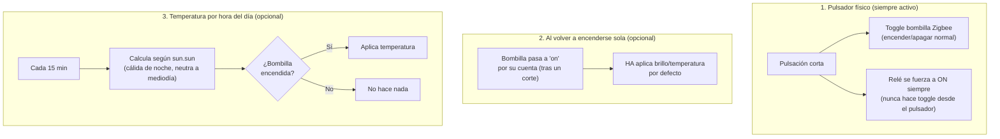

# `luz_zigbee_respaldo.yaml`

Para una luz cuyo brillo/temperatura de color se controla por una
bombilla Zigbee (no por `mega_dispositivos`, pensado para una IKEA
TRÅDFRI WW/CW regulable).

[:material-github: Ver el fichero en GitHub](https://github.com/GerardUmbert/arduino-mega-mqtt-ha/blob/master/home_assistant/blueprints/luz_zigbee_respaldo.yaml){ .md-button }

!!! success "Compatible con ambos firmwares"
    Solo usa pulsación corta — funciona igual en
    [`mega_pulsadores`](../firmware/mega-pulsadores.md) y
    [`mega_pulsadores_low_ram`](../firmware/mega-pulsadores-low-ram.md).

Hace tres cosas independientes:

## 1. Pulsador físico: toggle + relé de respaldo (siempre activo)

Al pulsar el botón (pulsación corta) pasan dos cosas a la vez:

- Se hace **toggle de la bombilla Zigbee** (control normal de
  encender/apagar).
- El **relé se fuerza a ON siempre**, esté como esté — nunca hace
  toggle ni se apaga desde el pulsador, solo se garantiza que quede
  ON.

Así, si el relé se hubiera quedado en OFF por lo que sea, pulsar el
botón garantiza que la bombilla tiene corriente, sin depender de que
el relé ya estuviera bien.

!!! note "Nada se dispara solo"
    Nada de esto pasa solo porque HA o MQTT arranquen o se
    reconecten — el único disparador del relé es el pulsador físico.

## 2. Adaptar la bombilla al volver a encenderse sola (opcional)

La bombilla Zigbee tiene su propio comportamiento de recuperación tras
un corte (normalmente vuelve a su último estado). Cuando HA detecta
que esa bombilla pasa a `on` por su cuenta, opcionalmente le aplica un
brillo/temperatura de color por defecto en vez de dejar lo que la
bombilla decidiera por sí sola.

## 3. Temperatura de color por hora del día (opcional)

Cada 15 minutos ajusta la temperatura de color según la posición del
sol (`sun.sun`) — cálida de noche, más neutra a mediodía. Solo actúa
si la bombilla ya está encendida, nunca la enciende/apaga. El rango
por defecto (250-454 mireds) coincide con el rango real de fábrica de
la IKEA TRÅDFRI WW/CW.

## Instanciar el blueprint

Una instancia por cada luz Zigbee con relé de respaldo:

1. Ajustes → Automatizaciones y escenas → Blueprints → importar
   `luz_zigbee_respaldo.yaml` → Crear automatización.
2. **Relé**: el `switch.*` de `mega_dispositivos` de esa luz.
3. **Bombilla Zigbee**: la entidad `light.*` real.
4. **Pulsador (device) — toggle bombilla + fuerza relé a ON** y
   **Subtype del botón**: el pulsador físico de esta luz.
5. **Adaptar brillo/temperatura cuando la bombilla vuelve a
   encenderse sola**: opcional.
6. **Ajustar temperatura de color según la hora del día**: opcional,
   activa el ciclo automático cálida/fría. Ajusta
   `temp_calida_mireds`/`temp_fria_mireds` si tu bombilla tiene un
   rango distinto al de la IKEA TRÅDFRI WW/CW.
