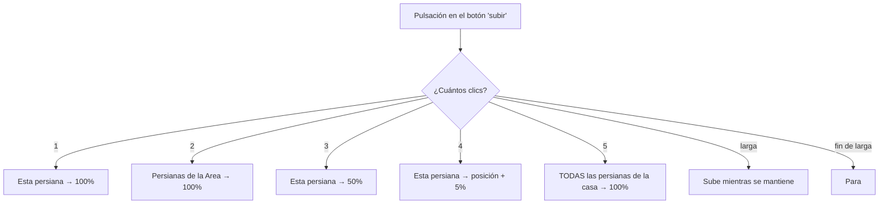

# `persiana_pulsador_completo.yaml`

Alternativa a [`persiana_pulsador.yaml`](persiana-pulsador.md) que
aprovecha los 5 niveles de pulsación del botón en vez de solo mantener
pulsado. Un botón de la agrupación de 4 hace SIEMPRE de "subir", otro
SIEMPRE de "bajar", para todas las persianas de esa agrupación.

[:material-github: Ver el fichero en GitHub](https://github.com/GerardUmbert/arduino-mega-mqtt-ha/blob/master/home_assistant/blueprints/persiana_pulsador_completo.yaml){ .md-button }

!!! danger "Solo compatible con mega_pulsadores (OneButton)"
    Este blueprint necesita los 5 niveles de clic a la vez.
    [`mega_pulsadores_low_ram`](../firmware/mega-pulsadores-low-ram.md)
    (AceButton) solo ofrece 2 slots de clic (single/double) — **no
    instancies este blueprint** sobre un pulsador de esa unidad, no
    hay forma de remapearlo. Ver la
    [guía de decisión](../firmware/decision.md).

## Tabla de pulsaciones

| Pulsaciones | Botón subir | Botón bajar |
|:---:|---|---|
| 1 | esta persiana → 100% | esta persiana → 0% |
| 2 | persianas de la misma Area → 100% cada una | ídem → 0% cada una |
| 3 | esta persiana → 50% | esta persiana → 50% |
| 4 | esta persiana → posición actual + 5% | esta persiana → posición actual − 5% |
| 5 | TODAS las persianas de la casa → 100% | TODAS → 0% |
| larga / fin | subir mientras se mantiene, parar al soltar | bajar mientras se mantiene, parar al soltar |

Usa directamente `cover.open_cover` / `close_cover` / `stop_cover` /
`set_cover_position` sobre la posición **nativa** que reporta
`mega_dispositivos` (firmware 1.6.0+) — sin helpers `input_number` ni
`input_datetime`.

!!! warning "Requiere posición nativa en todas las persianas afectadas"
    Toda persiana que pueda verse afectada (incluidas las de la Area
    en doble pulsación, o todas las de la casa en quíntuple) debe
    soportar de verdad `set_cover_position` — si alguna corre un
    firmware sin posición (versión anterior a 1.6.0 sin actualizar),
    la llamada a esa persiana en concreto no hace nada, **sin error
    visible**.

## Instanciar el blueprint

Dos instancias por persiana (una por botón subir, otra por bajar) — o
más si varias persianas comparten el mismo par de botones subir/bajar:

1. Ajustes → Automatizaciones y escenas → Blueprints → importar
   `persiana_pulsador_completo.yaml` → Crear automatización.
2. **Pulsador (device)** y **Subtype del botón**: igual que en los
   otros blueprints de pulsador.
3. **Persiana controlada por este botón**: la entidad `cover` concreta
   (para 1/3/4/larga; 2/5 se calculan solas a partir de esta).
4. **Dirección**: Subir o Bajar, según qué botón sea este.
