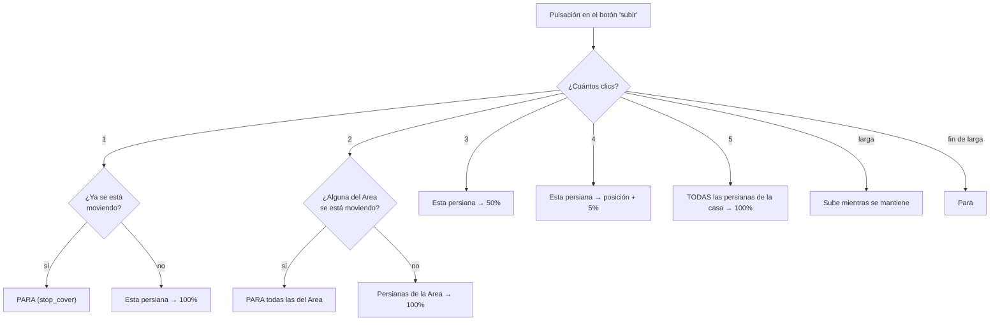

# `persiana_pulsador_completo.yaml`

Alternativa a [`persiana_pulsador.yaml`](persiana-pulsador.md) que
aprovecha los 5 niveles de pulsación del botón en vez de solo mantener
pulsado. Un botón de la agrupación de 4 hace SIEMPRE de "subir", otro
SIEMPRE de "bajar", para todas las persianas de esa agrupación.

[:material-github: Ver el fichero en GitHub](https://github.com/GerardUmbert/arduino-mega-mqtt-ha/blob/master/home_assistant/blueprints/persiana_pulsador_completo.yaml){ .md-button }

!!! danger "Solo compatible con mega_pulsadores (OneButton)"
    Este blueprint necesita los 5 niveles de clic a la vez.
    [`mega_pulsadores_low_ram`](../firmware/mega-pulsadores-low-ram.md)
    (AceButton) solo ofrece 2 slots de clic (single/double) — **no
    instancies este blueprint** sobre un pulsador de esa unidad, no
    hay forma de remapearlo. Ver la
    [guía de decisión](../firmware/decision.md).

## Tabla de pulsaciones

| Pulsaciones | Botón subir | Botón bajar |
|:---:|---|---|
| 1 | esta persiana → 100%, o **PARA** si ya se mueve | esta persiana → 0%, o **PARA** si ya se mueve |
| 2 | persianas de la misma Area → 100% cada una, o **PARA todas** si alguna se mueve | ídem → 0% cada una, o **PARA todas** |
| 3 | esta persiana → 50% | esta persiana → 50% |
| 4 | esta persiana → posición actual + 5% | esta persiana → posición actual − 5% |
| 5 | TODAS las persianas de la casa → 100% | TODAS → 0% |
| larga / fin | subir mientras se mantiene, parar al soltar | bajar mientras se mantiene, parar al soltar |

!!! tip "2 pulsaciones paran todo el Area (desde `v1.2.0`)"
    Mismo toggle que 1 pulsación, pero a nivel de Area: si **alguna**
    persiana del área se está moviendo, las **para todas**. Si están
    todas quietas, las lanza al extremo.

    Basta con que una se mueva para parar todas, a propósito: con
    varias persianas el estado puede ser mixto, y al machacar el botón
    lo que se espera es "para la habitación", no un toggle
    independiente por persiana que dejaría unas subiendo y otras
    paradas según el instante.

!!! tip "1 pulsación hace toggle (desde `v1.1.0`)"
    Si la persiana está quieta, 1 pulsación la lanza al extremo. Si ya
    se está moviendo, la **para** donde esté — así se puede detener a
    media altura con un segundo toque corto, sin tener que mantener
    pulsado y soltar en el punto justo.

    Requiere que la persiana reporte los estados intermedios
    `opening`/`closing` mientras se mueve, cosa que `mega_dispositivos`
    hace desde el firmware 1.6.0+. En una persiana que no los reporte,
    la condición nunca se cumple y el botón se comporta como antes:
    siempre lanza el movimiento, nunca para. Degradación silenciosa, sin
    error visible.

    Las pulsaciones 2/3/4/5 **no** hacen toggle a propósito: son órdenes
    de destino concreto ("ve al 50%", "+5%"), no "muévete", así que se
    aplican también con la persiana en marcha.

Usa directamente `cover.open_cover` / `close_cover` / `stop_cover` /
`set_cover_position` sobre la posición **nativa** que reporta
`mega_dispositivos` (firmware 1.6.0+) — sin helpers `input_number` ni
`input_datetime`.

!!! warning "Requiere posición nativa en todas las persianas afectadas"
    Toda persiana que pueda verse afectada (incluidas las de la Area
    en doble pulsación, o todas las de la casa en quíntuple) debe
    soportar de verdad `set_cover_position` — si alguna corre un
    firmware sin posición (versión anterior a 1.6.0 sin actualizar),
    la llamada a esa persiana en concreto no hace nada, **sin error
    visible**.

## Instanciar el blueprint

Desde `v2.0.0`, **una sola instancia por persiana** — los dos botones de
la pareja se indican en la misma automatización:

1. Ajustes → Automatizaciones y escenas → Blueprints → importar
   `persiana_pulsador_completo.yaml` → Crear automatización.
2. **Pulsador (device)**: el device MQTT donde están cableados ambos
   botones.
3. **Subtype del botón de SUBIR** y **Subtype del botón de BAJAR**: los
   dos pines de la pareja, p. ej. `p22` y `p23`.
4. **Persiana controlada por esta pareja de botones**: la entidad
   `cover` concreta (para 1/3/4/larga; 2/5 se calculan solas a partir de
   esta).

Ya no hay input **Dirección**: se deduce de cuál de los dos botones ha
disparado, comprobando el sufijo `_sube`/`_baja` del `trigger.id`.

!!! danger "Cambio incompatible en `v2.0.0`"
    Los inputs han cambiado (`boton_subtype` se parte en
    `boton_subtype_subir` + `boton_subtype_bajar`, y desaparece
    `direccion`), así que **las automatizaciones creadas con `v1.x`
    dejan de funcionar** al reimportar el blueprint — HA no puede
    migrar inputs que ya no existen.

    Hay que recrearlas: una instancia nueva por persiana, indicando los
    dos pines, en lugar de las dos que había antes.
