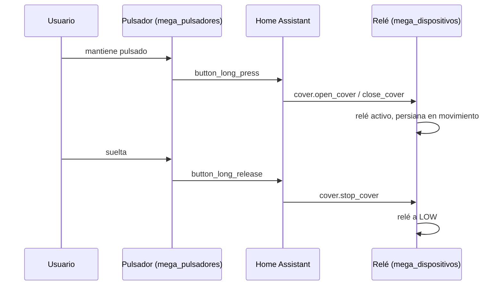

# `persiana_pulsador.yaml`

Mantener pulsado un botón de la agrupación de 4 sube o baja la
persiana, soltar para. Un botón de la agrupación se asigna a subir,
otro a bajar — cada uno es una instancia separada de este blueprint.

[:material-github: Ver el fichero en GitHub](https://github.com/GerardUmbert/ruben_smart_home_arduino/blob/master/home_assistant/blueprints/persiana_pulsador.yaml){ .md-button }

Usa los triggers `button_long_press` (empezar a mantener pulsado) y
`button_long_release` (soltar) que expone tanto
[`mega_pulsadores`](../firmware/mega-pulsadores.md) como
[`mega_pulsadores_low_ram`](../firmware/mega-pulsadores-low-ram.md) —
funciona igual en ambos firmwares.

## Instanciar el blueprint

Por cada botón de la agrupación que vaya a mover esta persiana
(normalmente 2: uno para abrir, otro para cerrar):

1. Ajustes → Automatizaciones y escenas → Blueprints → importar
   `persiana_pulsador.yaml` → Crear automatización.
2. **Pulsador (device)**: elige el device MQTT correspondiente ("Mega
   Pulsadores A" o "B", según en cuál esté cableado el botón físico).
3. **Subtype del botón**: el `object_id` del botón tal cual lo genera
   el firmware, con el número de pin — p. ej. `p14`. Más fiable
   elegir el trigger desde la UI de "Añadir disparador" → Device →
   seleccionar el device y el evento "Button Long Press" del botón
   concreto, y copiar el subtype que HA rellena solo.
4. **Persiana**: la entidad `cover` a mover (p. ej.
   `cover.persiana_38_39`).
5. **Acción al mantener pulsado**: "Abrir / subir" o "Cerrar / bajar"
   según qué botón de la agrupación sea este.

Repite para el segundo botón (el de la acción contraria) sobre la
misma persiana.
