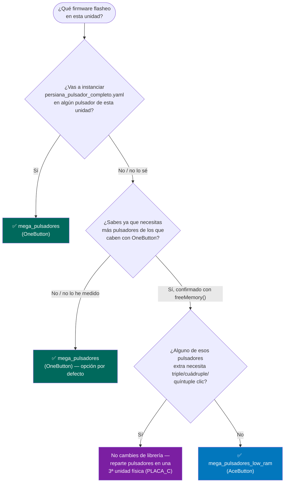

# Guía de decisión: ¿qué firmware de pulsadores flashear?

## Diagrama de decisión

## Por qué esta es la regla

- **`persiana_pulsador_completo.yaml` es el único caso sin remedio.**
  Usa los 5 niveles de clic (corta/doble/triple/cuádruple/quíntuple) a
  la vez, y `AceButton` solo ofrece 2 slots (single/double) — no hay
  forma de remapear 5 niveles en 2 huecos. Si una unidad va a correr
  este blueprint en alguno de sus pulsadores, tiene que ser
  `mega_pulsadores` (OneButton).
- **`OneButton` es la opción por defecto** salvo que confirmes que
  necesitas más pulsadores de los que caben en RAM con esa librería.
  No lo asumas — mide primero, ver [RAM y rendimiento](../reference/ram.md).
- **Si necesitas más pulsadores Y ninguno usa triple/cuádruple/quíntuple**,
  `mega_pulsadores_low_ram` (AceButton) es una opción real: mismo
  comportamiento para corta/doble/larga/fin de larga, mucha menos RAM
  por pulsador.
- **Si necesitas más pulsadores Y alguno SÍ necesita triple+**, la
  solución no es cambiar de librería en esa unidad — es repartir los
  pulsadores entre más unidades físicas. La arquitectura ya lo
  permite: añadir `PLACA_C`, `board_config_c.h` y un tercer byte de
  MAC, mismo patrón que A/B.

## Tabla de compatibilidad por blueprint

| Blueprint | `mega_pulsadores` (OneButton) | `mega_pulsadores_low_ram` (AceButton) |
|---|:---:|:---:|
| [`persiana_pulsador.yaml`](../blueprints/persiana-pulsador.md) | ✅ | ✅ (solo usa larga/fin de larga) |
| [`persiana_pulsador_completo.yaml`](../blueprints/persiana-pulsador-completo.md) | ✅ | ❌ **incompatible** |
| [`luz_pulsador.yaml`](../blueprints/luz-pulsador.md) | ✅ | ✅ (usa corta/doble/larga) |
| [`luz_zigbee_respaldo.yaml`](../blueprints/luz-zigbee-respaldo.md) | ✅ | ✅ (solo usa corta) |

!!! info "El research completo"
    La comparativa evento por evento con otras librerías consideradas
    (Bounce2, ezButton, Button2) y el detalle de por qué se descartó
    sustituir OneButton directamente en vez de mantener dos firmwares
    está en
    [`mega_pulsadores/to_review.md`](https://github.com/GerardUmbert/ruben_smart_home_arduino/blob/master/mega_pulsadores/to_review.md).
