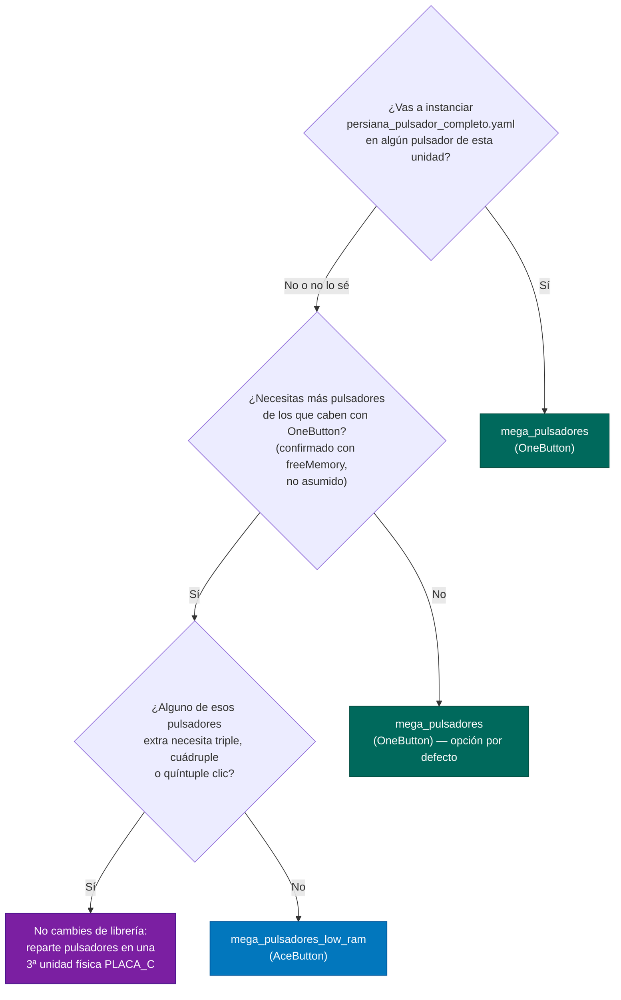

# Guía de decisión: ¿qué firmware de pulsadores flashear?

## Diagrama de decisión

## Por qué esta es la regla

- **`persiana_pulsador_completo.yaml` es el único caso con
  funcionalidad reducida, no un fallo total.** Usa 5 niveles de clic
  (corta/doble/triple/cuádruple/quíntuple) + larga/fin de larga, y
  `AceButton` solo cubre 4 de esos 7 eventos (corta, doble, larga,
  fin de larga) — no hay forma de remapear triple/cuádruple/quíntuple
  a ningún hueco libre, porque `AceButton` no tiene slots de clic
  extra. En la práctica: si instalas este blueprint sobre un
  pulsador de `mega_pulsadores_low_ram`, las pulsaciones 1, 2, larga
  y fin de larga funcionan exactamente igual que con `OneButton` —
  solo las pulsaciones 3 (50%), 4 (±5%) y 5 (toda la casa) dejan de
  dispararse, sin error visible. Si necesitas los 5 niveles
  completos en un pulsador, esa unidad tiene que ser `mega_pulsadores`
  (OneButton).
- **`OneButton` es la opción por defecto** salvo que confirmes que
  necesitas más pulsadores de los que caben en RAM con esa librería.
  No lo asumas — mide primero, ver [RAM y rendimiento](../reference/ram.md).
- **Si necesitas más pulsadores Y ninguno usa triple/cuádruple/quíntuple**,
  `mega_pulsadores_low_ram` (AceButton) es una opción real: mismo
  comportamiento para corta/doble/larga/fin de larga, mucha menos RAM
  por pulsador.
- **Si necesitas más pulsadores Y alguno SÍ necesita triple+**, la
  solución no es cambiar de librería en esa unidad — es repartir los
  pulsadores entre más unidades físicas. La arquitectura ya lo
  permite: añadir `PLACA_C`, `board_config_c.h` y un tercer byte de
  MAC, mismo patrón que A/B.

## Tabla de compatibilidad por blueprint

| Blueprint | `mega_pulsadores` (OneButton) | `mega_pulsadores_low_ram` (AceButton) |
|---|:---:|:---:|
| [`persiana_pulsador`](../blueprints/persiana-pulsador.md) | ✅ Completa | ✅ Completa (solo usa larga/fin de larga) |
| [`persiana_pulsador_completo`](../blueprints/persiana-pulsador-completo.md) | ✅ Completa | ⚠️ Parcial — pulsaciones 1/2/larga/fin de larga funcionan, 3/4/5 no se disparan |
| [`luz_pulsador`](../blueprints/luz-pulsador.md) | ✅ Completa | ✅ Completa (usa corta/doble/larga) |
| [`luz_zigbee_respaldo`](../blueprints/luz-zigbee-respaldo.md) | ✅ Completa | ✅ Completa (solo usa corta) |

!!! info "El research completo"
    La comparativa evento por evento con otras librerías consideradas
    (Bounce2, ezButton, Button2) y el detalle de por qué se descartó
    sustituir OneButton directamente en vez de mantener dos firmwares
    está en
    [`mega_pulsadores/to_review.md`](https://github.com/GerardUmbert/arduino-mega-mqtt-ha/blob/master/mega_pulsadores/to_review.md).
