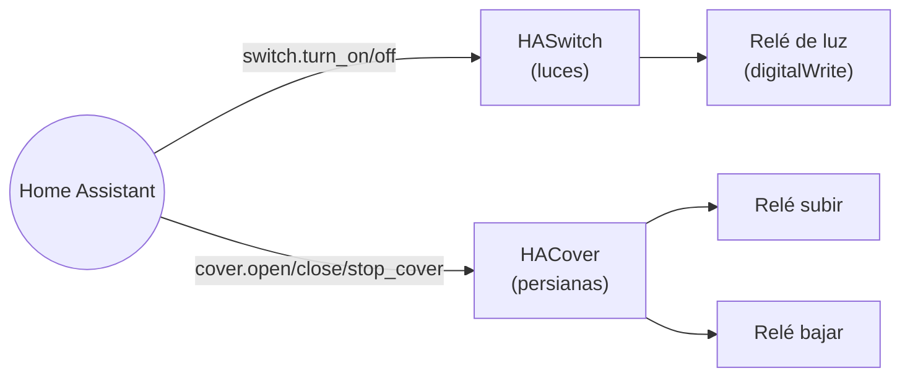

# `mega_dispositivos`

Firmware para las unidades que controlan relés de luces y persianas.
**No lee ningún pulsador — solo recibe órdenes MQTT y las ejecuta.**

[:material-github: Ver `mega_dispositivos.ino` en GitHub](https://github.com/GerardUmbert/arduino-mega-mqtt-ha/blob/master/mega_dispositivos/mega_dispositivos.ino){ .md-button }



## Entidades que crea

A diferencia de los `HADeviceTrigger` de
`mega_pulsadores`/`mega_pulsadores_low_ram` (sin estado, solo
disparadores), `mega_dispositivos` crea entidades **con estado
persistente** que refleja el mundo físico (encendido/apagado,
posición):

| Entidad | Nombre (`unique_id`) | Soporta |
|---|---|---|
| `HASwitch` por luz | `luz_22`, `luz_30`... (número de pin) | on/off |
| `HACover` por persiana | `persiana_38_39`, `persiana_41_42`... (pin subir + pin bajar, en ese orden siempre) | abrir/cerrar/parar + posición nativa reportada (firmware 1.6.0+) |

!!! info "Posición nativa de persianas: se reporta, pero no se comanda"
    Desde la versión 1.6.0, cada persiana reporta su propia posición
    (0-100%) directamente por MQTT, estimada por tiempo de relé
    activo. La tarjeta normal de HA muestra el slider de posición.

    `cover.set_cover_position` **no hace nada** sobre estas entidades:
    la librería `ArduinoHA` solo permite reportar posición, no
    recibir comandos de posición desde HA (confirmado intentando
    añadir soporte en la v1.8.0, revertido — ver `CHANGELOG.md`). Para
    "ir a X%" de verdad, usa el blueprint
    `persiana_ir_a_posicion.yaml`, que vigila la posición reportada y
    para el movimiento al cruzarla.

## Configuración de pines

```cpp
struct ParPines { uint8_t subir; uint8_t bajar; };
```

Cada persiana se define como un **par de pines** (subir/bajar) en
`board_config_a.h`/`board_config_b.h`. El `unique_id` incluye ambos
pines del par, **siempre en el orden subir_bajar** (p. ej.
`{subir: 38, bajar: 39}` → `persiana_38_39`), nunca al revés.

## Seguridad: interlock entre subir y bajar

Hay un tiempo de seguridad (`RETARDO_INVERSION_MS`) entre apagar un
sentido y encender el otro, para no invertir el sentido de giro del
motor demasiado rápido. Parar = poner los dos relés (subir/bajar) a
LOW simultáneamente.

## Compatible con 0 persianas

Una unidad puede configurarse con `PINES_PERSIANAS[] = {}` (solo
luces, sin persianas) sin problema — corregido en la versión 1.6.3
tras un bug de compilación con arrays de tamaño 0. Ver
[Changelog](../reference/changelog.md).
