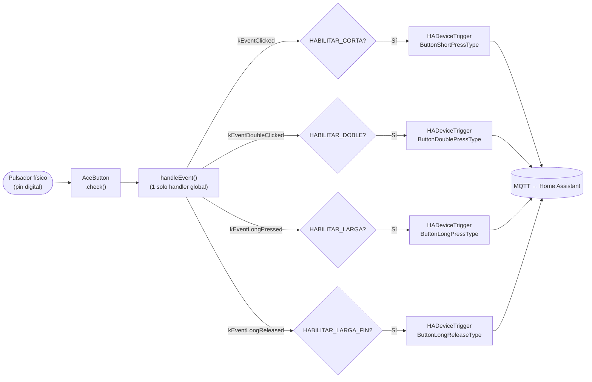
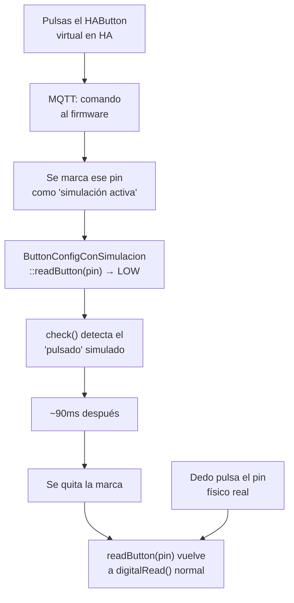

# `mega_pulsadores_low_ram` (AceButton)

Firmware **alternativo** para el mismo rol que
[`mega_pulsadores`](mega-pulsadores.md), usando la librería
[`AceButton`](https://github.com/bxparks/AceButton) en vez de
`OneButton`: mucha menos RAM por pulsador, a cambio de perder soporte
de triple/cuádruple/quíntuple clic **por completo**.

[:material-github: Ver `mega_pulsadores_low_ram.ino` en GitHub](https://github.com/GerardUmbert/arduino-mega-mqtt-ha/blob/master/mega_pulsadores_low_ram/mega_pulsadores_low_ram.ino){ .md-button }

!!! danger "¿Ya sabes si te conviene este firmware?"
    Si tienes dudas, usa la [guía de decisión](decision.md) antes de
    seguir leyendo esta página.

## Los 4 eventos posibles

`AceButton` **no tiene ningún mecanismo** para contar 3+ pulsaciones
seguidas — no es una opción desactivable como en `mega_pulsadores`, la
librería solo distingue click simple y doble click.

```cpp
#define HABILITAR_CORTA
#define HABILITAR_DOBLE
#define HABILITAR_LARGA
#define HABILITAR_LARGA_FIN
```

| Evento | `#define` | Activo por defecto | Evento AceButton |
|---|---|:---:|---|
| Corta | `HABILITAR_CORTA` | ✅ | `kEventClicked` |
| Doble | `HABILITAR_DOBLE` | ✅ | `kEventDoubleClicked` |
| Triple | — | — | ❌ **no existe** |
| Cuádruple | — | — | ❌ **no existe** |
| Quíntuple | — | — | ❌ **no existe** |
| Larga (inicio) | `HABILITAR_LARGA` | ✅ | `kEventLongPressed` |
| Larga (fin, al soltar) | `HABILITAR_LARGA_FIN` | ✅ | `kEventLongReleased` |

## Otros dos flags (RAM)

Además de los 4 eventos, hay dos interruptores más, ambos **activados
por defecto** — si no los tocas, nada cambia:

| `#define` | Desde | Qué quita al comentarlo |
|---|---|---|
| `HABILITAR_BOTON_VIRTUAL` | 1.8.6 | Los `HAButton` ("Press" en Controls de HA) y todo su andamiaje de simulación. **~31 bytes/pulsador** (~750 con 24) |
| `HABILITAR_DEBUG` | 1.8.7 | `freeMemory()`, el contador de entidades, el retorno de `setBufferSize()` y el `[publicado]/[FALLO MQTT]` de cada pulsación |

!!! tip "Qué NO se pierde al apagar `HABILITAR_BOTON_VIRTUAL`"
    Los pulsadores **físicos** siguen funcionando exactamente igual:
    corta, doble, larga y fin de larga se publican como siempre, que es
    lo que usan los blueprints y las automatizaciones por *device
    trigger*. Solo desaparecen los botones "Press" de la UI de HA, que
    servían para **simular** una pulsación corta desde la app.

    Esos botones virtuales nunca pudieron simular pulsación larga (el
    pulso es corto y fijo, `SIMULACION_PULSO_MS`), así que apagarlos no
    quita ninguna capacidad de larga.

!!! warning "`HABILITAR_DEBUG` no es solo RAM"
    Cada `Serial.print` **bloquea el loop** mientras vacía el buffer a
    9600 baudios, y `AceButton` necesita `check()` cada <5ms para que el
    debounce y la detección de multiclic funcionen (documentado en
    `AceButton.h`). Con muchos pulsadores y una línea impresa por
    pulsación, esa pausa se nota — déjalo activado mientras
    diagnosticas, apágalo en producción.



## Diferencia clave con OneButton en el código

`AceButton` usa **un único handler global** compartido por todos los
pulsadores (`handleEvent(AceButton* button, uint8_t eventType, uint8_t buttonState)`),
en vez de una función distinta por tipo de evento como hace
`OneButton`. La identificación de qué pulsador disparó el evento se
hace con `button->getId()`, en vez del `void* param` que usa
`OneButton`.

## RAM: por qué existe este firmware

| | `OneButton` | `AceButton` |
|---|---|---|
| RAM por instancia (solo la clase, AVR) | ~90-100 bytes, **fijo** — reserva sitio para las 8 callbacks posibles aunque no las uses | ~18-26 bytes |
| Motivo de la diferencia | Todas las variables miembro (8 punteros a función + parámetros) son incondicionales en la clase | Clase base más pequeña |
| **Límite práctico probado en placa** (firmware 1.8.0, con botón virtual, buffer 256) | 12 estable, 16 falla | **24 estable** (623 bytes libres), 25 arranca pero MQTT inestable — ver aviso de la 1.8.3 más abajo |
| **Coste real medido por pulsador** | No desglosado con la misma precisión todavía | **~263 bytes** |

!!! success "Confirmado en placa real (2026-09-05) — firmware 1.8.0, buffer MQTT de 256"
    | Pulsadores | RAM libre |
    |---|---|
    | 0 | 7033 bytes |
    | 1 | 6693 bytes |
    | 16 | 2727 bytes |
    | 24 | 623 bytes (estable) |
    | 25 | 361 bytes (MQTT inestable) |

!!! danger "Desde la 1.8.3 esos límites ya no aplican tal cual"
    El firmware llama a `mqtt.setBufferSize(512)` (imprescindible: con
    los 256 por defecto el discovery de los `HADeviceTrigger` no cabe y
    nunca llega a HA), y esos 512 bytes salen de la misma SRAM.

    Medido el 2026-09-17 con 1.8.5:

    | Pulsadores | Botón virtual | RAM libre | Estado |
    |---|---|---|---|
    | 16 | Activo | 1701 bytes | OK |
    | 24 | Activo | 623 bytes | Límite |
    | 28 | Desactivado | 373 bytes | **Inestable** (MQTT en bucle) |

    El umbral de inestabilidad ronda los **~370 bytes**. Ver
    [RAM y rendimiento](../reference/ram.md) para el detalle, incluido
    el bug de fragmentación del heap que hacía fallar
    `setBufferSize()` en silencio.

Ver [RAM y rendimiento](../reference/ram.md) para el desglose completo
y cómo medir tu propia configuración en placa real.

## Compatibilidad con blueprints

| Blueprint | ¿Compatible? | Notas |
|---|:---:|---|
| [`persiana_pulsador`](../blueprints/persiana-pulsador.md) | ✅ Completa | Solo usa larga/fin de larga |
| [`persiana_pulsador_completo`](../blueprints/persiana-pulsador-completo.md) | ⚠️ Parcial | Las pulsaciones 1 (100%/0%), 2 (Area) y larga/fin de larga (subir/bajar/parar) funcionan igual que en `mega_pulsadores`. Las pulsaciones 3 (50%), 4 (±5%) y 5 (toda la casa) **no se disparan nunca** — sus triggers (`button_triple_press`/`quadruple`/`quintuple`) no existen en este firmware, y no hay error visible, simplemente esos botones no hacen nada |
| [`luz_pulsador`](../blueprints/luz-pulsador.md) | ✅ Completa | Usa corta/doble/larga — el apagado automático se remapeó de triple a doble precisamente para que funcionara en ambos firmwares |
| [`luz_zigbee_respaldo`](../blueprints/luz-zigbee-respaldo.md) | ✅ Completa | Solo usa corta |

## Botón virtual: simular pulsaciones desde HA

!!! success "Desde la versión 1.8.0"
    Igual que en `mega_pulsadores`: cada pulsador tiene un `HAButton`
    virtual, entidad real y pulsable en la UI de HA, con `unique_id`
    `"v" + pNN` (ej. `vp14`).

El mecanismo de inyección es distinto al de `OneButton` porque
`AceButton` no tiene un método equivalente a `tick(bool)`. En su lugar
se usa el punto de extensión oficial de la librería: una subclase de
`ButtonConfig` que sobreescribe `readButton(pin)` (documentado en el
propio código fuente de AceButton como "Override to use something
other than digitalRead()") — mientras hay una simulación activa para
un pin, esa función devuelve `LOW` en vez de leer el pin real.
`check()` (llamado en `loop()`) usa esa función sin saber que es
distinta, así que toda la lógica de debounce/multiclic de `AceButton`
sigue intacta.



Misma limitación que en `mega_pulsadores`: el pulso simulado es corto
y fijo, sirve para corta/doble clic, no para simular pulsación larga.

## Configuración de pines y config.h

Igual que `mega_pulsadores`, pero con ficheros de configuración
**independientes** (Arduino exige que los `.h` vivan en la misma
carpeta que el `.ino`):

- `mega_pulsadores_low_ram/board_config_a.h`,
  `board_config_b.h` — copias de las de `mega_pulsadores/`, no
  compartidas. Si cambias pines/MAC/IP en una carpeta, revisa si el
  mismo cambio aplica también en la otra.
- `mega_pulsadores_low_ram/config.h` — necesita un paso extra al
  crearlo, ver [Configuración (config.h)](../getting-started/config.md#mega_pulsadores_low_ram-un-paso-extra-con-git).
