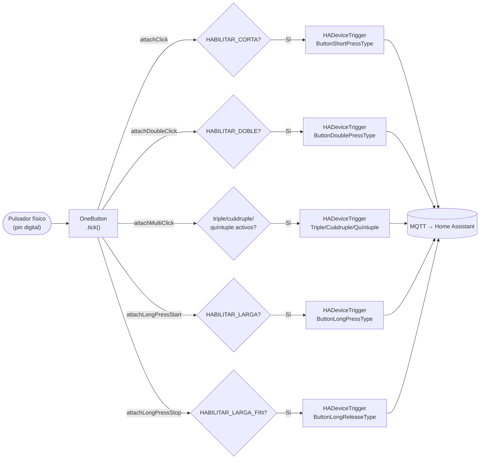

# `mega_pulsadores` (OneButton)

Firmware para las unidades que leen pulsadores físicos y envían
device triggers MQTT a Home Assistant. **No controla ningún relé,
solo envía información.**

[:material-github: Ver `mega_pulsadores.ino` en GitHub](https://github.com/GerardUmbert/arduino-mega-mqtt-ha/blob/master/mega_pulsadores/mega_pulsadores.ino){ .md-button }

## Los 7 eventos posibles

Cada uno de los 7 tipos de pulsación se activa/desactiva por separado
con un `#define` al principio del `.ino`:

```cpp
#define HABILITAR_CORTA
#define HABILITAR_DOBLE
// #define HABILITAR_TRIPLE
// #define HABILITAR_CUADRUPLE
// #define HABILITAR_QUINTUPLE
#define HABILITAR_LARGA
#define HABILITAR_LARGA_FIN
```

| Evento | `#define` | Activo por defecto | Trigger MQTT |
|---|---|:---:|---|
| Corta | `HABILITAR_CORTA` | ✅ | `ButtonShortPressType` |
| Doble | `HABILITAR_DOBLE` | ✅ | `ButtonDoublePressType` |
| Triple | `HABILITAR_TRIPLE` | ❌ | `ButtonTriplePressType` |
| Cuádruple | `HABILITAR_CUADRUPLE` | ❌ | `ButtonQuadruplePressType` |
| Quíntuple | `HABILITAR_QUINTUPLE` | ❌ | `ButtonQuintuplePressType` |
| Larga (inicio) | `HABILITAR_LARGA` | ✅ | `ButtonLongPressType` |
| Larga (fin, al soltar) | `HABILITAR_LARGA_FIN` | ✅ | `ButtonLongReleaseType` |



!!! warning "Antes de cambiar cualquier `HABILITAR_*`"
    Revisa qué blueprints tienes instanciados en HA para los
    pulsadores de esa unidad — un blueprint que espera un trigger que
    ya no existe simplemente deja de dispararse, **sin error
    visible**:

    - [`persiana_pulsador_completo.yaml`](../blueprints/persiana-pulsador-completo.md)
      usa las 5 pulsaciones + larga.
    - [`luz_pulsador.yaml`](../blueprints/luz-pulsador.md) usa
      corta/doble/larga.
    - [`persiana_pulsador.yaml`](../blueprints/persiana-pulsador.md)
      usa solo larga/fin de larga.

## Identificación de cada pulsador (subtype)

Cada pulsador se identifica en HA por su número de pin, formato
`pNN` — p. ej. el pulsador en el pin 14 se identifica como `p14`. Es
lo que aparece en el campo **"Subtype del botón"** al instanciar un
blueprint.

!!! tip "¿Por qué `pNN` y no `boton_NN`?"
    El formato cambió de `boton_NN` a `pNN` en la versión 1.7.1 para
    ahorrar RAM en el buffer de texto (10 → 4 bytes por pulsador). Si
    tienes automatizaciones instanciadas con el formato antiguo,
    tendrás que volver a seleccionar el trigger desde la UI tras
    actualizar — ver [Changelog](../reference/changelog.md).

## Configuración de pines

Los pines cableados en cada unidad física se definen en
`board_config_a.h` / `board_config_b.h` (según cuál placa sea, ver
[Identificación de unidades A/B](../getting-started/unidades.md)):

```cpp
const uint8_t PINES_BOTONES[] = {
    2, 3, 4, 5, 6, 7, 8, 9,
    14, 15, 16, 17, 18, 19,
    24, 25, 26, 27, 28, 29
};
```

El `unique_id`/subtype de cada pulsador se genera a partir de su
número de **pin**, no de su posición en esta lista — puedes reordenar,
insertar o borrar pines libremente sin que ningún trigger ya
renombrado en HA cambie de identidad.

## RAM

Ver [RAM y rendimiento](../reference/ram.md) para los datos medidos en
placa real (12 pulsadores con los 7 triggers arrancan bien, 16 ya
falla) y cómo medir tu propia configuración.
