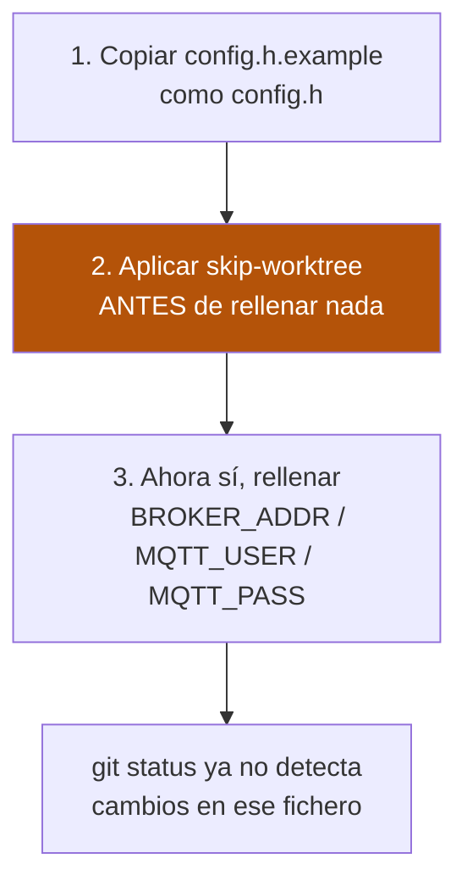

# Configuración de red (`config.h`)

`BROKER_ADDR`, `MQTT_USER` y `MQTT_PASS` **nunca** se escriben
directamente en los `.ino` — viven en un fichero `config.h` que cada
sketch incluye vía `#include "config.h"`.

!!! question "¿Descargaste el ZIP o clonaste con git?"
    Esta página tiene pasos distintos según cómo te bajaste el
    proyecto. Si no sabes qué es "clonar con git" o nunca has abierto
    una terminal para nada relacionado con git, **es casi seguro que
    te bajaste el ZIP** — ve directo a esa sección.

## Si te bajaste el proyecto como ZIP (sin git)

Esto es lo normal si has descargado el código desde el botón verde
**"Code" → "Download ZIP"** de GitHub, o alguien te ha pasado la
carpeta ya descomprimida.

**No tienes que preocuparte por git en absoluto** — no hay ningún
riesgo de subir tus credenciales por error, porque no tienes forma de
"subir" nada a ningún sitio, solo tienes los ficheros en tu ordenador.

Pasos:

1. Ve a cada una de estas tres carpetas: `mega_pulsadores/`,
   `mega_dispositivos/`, `mega_pulsadores_low_ram/`.
2. En cada una, busca un fichero llamado `config.h`:
   - Si ya existe (`mega_pulsadores/` y `mega_dispositivos/` lo
     traen), ábrelo directamente.
   - Si no existe (`mega_pulsadores_low_ram/`), busca
     `config.h.example`, haz una copia en la misma carpeta y
     renómbrala a `config.h`.
3. Abre `config.h` con cualquier editor de texto (Bloc de notas
   sirve) y rellena tus valores reales:
   - `BROKER_ADDR`: la IP de tu Home Assistant / servidor Mosquitto.
   - `MQTT_USER` / `MQTT_PASS`: usuario y contraseña del broker MQTT.
4. Guarda el fichero. Ya está — no hay ningún paso más.

!!! warning "No compartas ese fichero ni la carpeta entera"
    Una vez rellenado, `config.h` contiene tus credenciales reales de
    red. Si vas a compartir tu copia del proyecto con otra persona
    (por email, USB, etc.), asegúrate de no incluir ese fichero
    relleno — comparte `config.h.example` en su lugar, o borra el
    contenido real antes de enviarlo.

## Si clonaste el repositorio con git

Como el repositorio es público, hay que evitar que tus credenciales
reales queden grabadas en el historial de git (que cualquiera puede
ver). Por eso el proyecto usa una protección de git llamada
`skip-worktree`.

**¿Qué hace `skip-worktree`?** Le dice a git "deja de vigilar cambios
en este fichero concreto, ignóralo siempre a partir de ahora, aunque
lo edite". Así puedes rellenar tus credenciales reales sin que
aparezcan nunca en `git status` ni se incluyan nunca en un commit,
aunque más tarde hagas `git add -A` o similar sin fijarte.

| Carpeta | ¿`config.h` ya existe en el repo? | ¿Ya tiene `skip-worktree` aplicado? |
|---|---|---|
| `mega_pulsadores/` | ✅ Sí, con placeholders vacíos | ✅ Sí, de fábrica |
| `mega_dispositivos/` | ✅ Sí, con placeholders vacíos | ✅ Sí, de fábrica |
| `mega_pulsadores_low_ram/` | ❌ No — solo `config.h.example` | ⚠️ No puede estarlo hasta que exista (ver más abajo) |

### `mega_pulsadores/` y `mega_dispositivos/`

Estas dos ya vienen listas — no hace falta ningún comando de git.

1. Abre directamente `config.h` (ya existe, con placeholders vacíos).
2. Rellena `BROKER_ADDR`, `MQTT_USER` y `MQTT_PASS` con tus valores
   reales.

`config.h.example` es solo la plantilla documentada de referencia — no
hace falta copiarla, `config.h` ya está listo para editar.

Como las 2 unidades de cada rol (A y B) comparten el mismo broker
MQTT, normalmente usarás el mismo `config.h` en ambas — solo cambia el
`#define PLACA_A`/`PLACA_B` para diferenciarlas.

### `mega_pulsadores_low_ram/` — un paso extra con git

Como este `config.h` nunca se ha creado en el repo, `skip-worktree` no
se le puede aplicar de antemano — solo funciona sobre ficheros que ya
existen. Tienes que crearlo y protegerlo tú mismo, **en este orden**:



1. Copia `config.h.example` como `config.h` en
   `mega_pulsadores_low_ram/`.
2. **Antes de rellenar nada real**, abre una terminal en la carpeta
   del proyecto y ejecuta:
   ```
   git update-index --skip-worktree mega_pulsadores_low_ram/config.h
   ```
3. Ahora sí, rellena `BROKER_ADDR`/`MQTT_USER`/`MQTT_PASS` con tus
   valores reales — git ya no detectará ese cambio.

!!! danger "Si rellenaste credenciales reales antes del paso 2"
    Ejecuta `git status` — si `mega_pulsadores_low_ram/config.h`
    aparece como modificado/nuevo, **no hagas commit todavía**. Aplica
    el `skip-worktree` del paso 2 primero.
