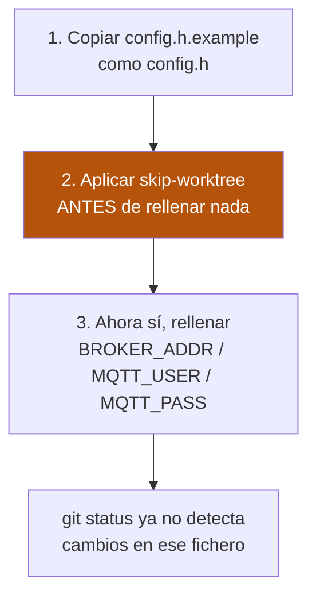

# Configuración de red (`config.h`)

`BROKER_ADDR`, `MQTT_USER` y `MQTT_PASS` **nunca** se escriben
directamente en los `.ino` — viven en un fichero `config.h` que cada
sketch incluye vía `#include "config.h"`.

Hay **tres** carpetas de firmware, cada una con su propio `config.h`:

| Carpeta | ¿`config.h` ya existe en el repo? | ¿Protegido con `skip-worktree`? |
|---|---|---|
| `mega_pulsadores/` | ✅ Sí, con placeholders vacíos | ✅ Sí |
| `mega_dispositivos/` | ✅ Sí, con placeholders vacíos | ✅ Sí |
| `mega_pulsadores_low_ram/` | ❌ No — solo `config.h.example` | ⚠️ No puede estarlo hasta que exista |

## `mega_pulsadores/` y `mega_dispositivos/`

`config.h` **sí** viene incluido en el repo (con los `#define`
vacíos/de ejemplo) para que el proyecto compile nada más clonarlo, sin
pasos adicionales.

Para que tus credenciales reales no se suban por error, ambos
`config.h` están marcados localmente con
`git update-index --skip-worktree`: una vez rellenes tus datos reales,
git deja de detectar cambios en ese fichero y nunca aparecerá en
`git status` ni se subirá en un commit.

**Pasos:**

1. Abre directamente `config.h` (ya existe, con placeholders vacíos).
2. Rellena `BROKER_ADDR`, `MQTT_USER` y `MQTT_PASS` con tus valores
   reales.

`config.h.example` es solo la plantilla documentada de referencia — no
hace falta copiarla, `config.h` ya está listo para editar.

Como las 2 unidades de cada rol (A y B) comparten el mismo broker
MQTT, normalmente usarás el mismo `config.h` en ambas — solo cambia el
`#define PLACA_A`/`PLACA_B` para diferenciarlas.

## `mega_pulsadores_low_ram/` — un paso extra

!!! warning "Este `config.h` NO está protegido todavía"
    `git update-index --skip-worktree` solo se puede aplicar a un
    fichero que **ya existe** en el repo. Como
    `mega_pulsadores_low_ram/config.h` nunca se ha creado (a
    diferencia de los otros dos), hay que aplicar el flag **tú
    mismo**, en el orden correcto, o corres el riesgo de subir
    credenciales reales por error.

**Pasos, en este orden exacto:**



1. Copia `config.h.example` como `config.h` en
   `mega_pulsadores_low_ram/`.
2. **Antes de rellenar nada real**, marca el fichero para que git
   ignore futuros cambios:
   ```
   git update-index --skip-worktree mega_pulsadores_low_ram/config.h
   ```
3. Ahora sí, rellena `BROKER_ADDR`/`MQTT_USER`/`MQTT_PASS` con tus
   valores reales — git ya no detectará ese cambio.

!!! danger "Si rellenaste credenciales reales antes del paso 2"
    Revisa `git status` — si `mega_pulsadores_low_ram/config.h`
    aparece como modificado/nuevo, **no hagas commit todavía**. Aplica
    el `skip-worktree` del paso 2 primero.
