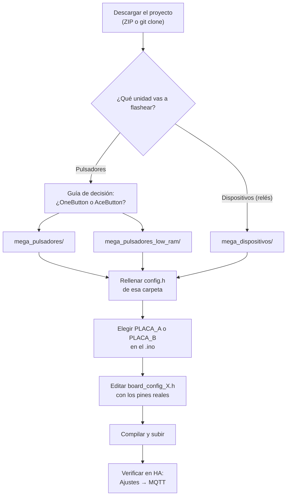

# Empezando

Antes de flashear nada, necesitas tres cosas resueltas:

1. **Hardware correcto** → [Hardware](hardware.md)
2. **Credenciales MQTT rellenadas** → [Configuración (config.h)](config.md)
3. **Saber qué unidad física estás flasheando** → [Identificación de unidades A/B](unidades.md)

Y si vas a flashear una unidad de **pulsadores** en concreto, hay un
paso extra antes de todo esto: decidir qué firmware usar. Ver la
[guía de decisión](../firmware/decision.md).

## Resumen del flujo de trabajo

