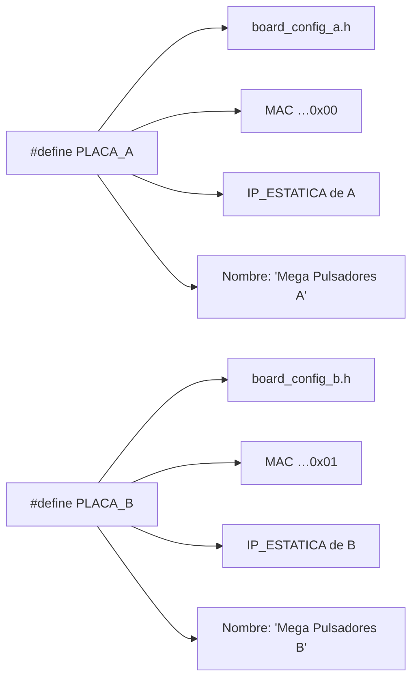

# Identificación de unidades A/B

Cada rol usa un único fichero `.ino` (o, para pulsadores, uno de los
dos firmwares posibles), pero la identidad de cada unidad física (A o
B) se decide en **tiempo de compilación**, no con un jumper físico.

Al principio del `.ino` hay un bloque `PLACA_A`/`PLACA_B`:

```cpp
#define PLACA_A
// #define PLACA_B
```

Se deja descomentada **SOLO una** de las dos líneas según a qué unidad
física vayas a subir ese firmware, se compila y se sube. Para la otra
unidad, se cambia la línea descomentada y se vuelve a subir.



Ese único `#define` selecciona a la vez **cuatro cosas**:

- Qué fichero de configuración se incluye (`board_config_a.h` o
  `board_config_b.h`), con los pines realmente cableados en esa
  unidad.
- El último byte de la MAC (distinto en A y B, para no colisionar en
  la red).
- La IP fija de esa unidad (`IP_ESTATICA`, distinta en A y B).
- El nombre del dispositivo en HA (`Mega Pulsadores A/B`, `Mega
  Dispositivos A/B`).

!!! success "Protección contra errores"
    Si por error se compila sin descomentar ninguna línea, o con las
    dos a la vez, el propio `.ino` falla la compilación con un
    `#error` explícito en vez de subir un firmware con identidad
    ambigua.

## Direcciones MAC

Las MACs se inventan localmente porque el Mega + shield Ethernet no
trae MAC de fábrica (primer byte `0x02` = "administrada localmente").
El byte `[3]` distingue familia (`0x01` = mega_pulsadores, `0x02` =
mega_dispositivos) para que nunca choquen en la red, y el último byte
distingue unidad A (`0x00`) de B (`0x01`).

Se usa además `device.enableExtendedUniqueIds()` para que HA no
confunda entidades con el mismo ID (p. ej. `p14`) entre la unidad A y
la B del mismo rol.
