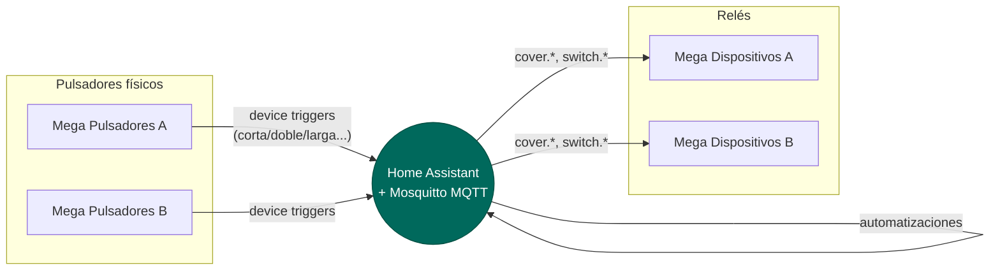

# Domótica con Arduino Mega + Home Assistant

Sistema de domótica doméstica basado en **4 Arduino Mega 2560**
repartidos en 2 roles, que se comunican con Home Assistant vía MQTT
usando la librería [ArduinoHA](https://github.com/dawidchyrzynski/arduino-home-assistant).

Home Assistant actúa como "cerebro": recibe eventos de los pulsadores
y, mediante automatizaciones, envía comandos a los relés que
controlan luces y persianas. **Los Arduinos nunca se comunican
directamente entre sí.**

## Por dónde empezar

-   :material-flash: **Nunca has tocado este proyecto**

    ---

    Empieza por [Empezando](getting-started/index.md): hardware,
    identificación de unidades A/B y cómo rellenar `config.h`.

-   :material-source-branch: **Vas a flashear una unidad de pulsadores**

    ---

    Usa la [guía de decisión](firmware/decision.md) para elegir entre
    `mega_pulsadores` y `mega_pulsadores_low_ram` antes de subir nada.

-   :material-home-automation: **Vas a crear una automatización en HA**

    ---

    Consulta los [blueprints](blueprints/index.md) — cada uno documenta
    qué pulsación hace qué, y con qué firmware es compatible.

-   :material-memory: **La placa se reinicia sola / vas justo de RAM**

    ---

    Ve directo a [RAM y rendimiento](reference/ram.md) o a
    [Solución de problemas](reference/troubleshooting.md).

## Arquitectura en una frase

| Rol | Unidades | Qué hace | Qué NO hace |
|---|---|---|---|
| `mega_pulsadores` **o** `mega_pulsadores_low_ram` | A, B | Lee pulsadores físicos, envía eventos MQTT | No controla ningún relé |
| `mega_dispositivos` | A, B | Controla relés de luces y persianas | No lee ningún pulsador |

Cada rol usa un único fichero `.ino` (o, en el caso de pulsadores, uno
de los dos firmwares posibles), pero la identidad de cada unidad física
(A o B) se decide en **tiempo de compilación** — ver
[Identificación de unidades A/B](getting-started/unidades.md).

!!! tip "Código fuente"
    Esta documentación describe el repositorio
    [`ruben_smart_home_arduino`](https://github.com/GerardUmbert/ruben_smart_home_arduino).
    Cada página enlaza al fichero real correspondiente — esta web es una
    guía de lectura, no sustituye al código ni a los comentarios dentro
    de cada `.ino`.
