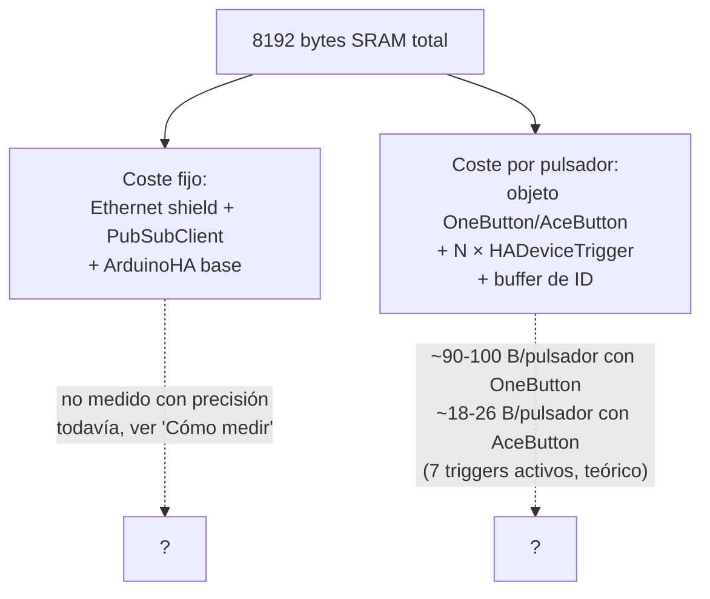
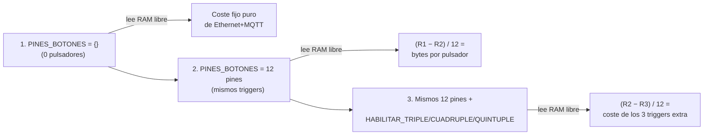

# RAM y rendimiento

El Arduino Mega 2560 tiene **8&nbsp;KB (8192 bytes) de SRAM totales**.
Esto es lo único que limita cuántos pulsadores puede manejar una
unidad `mega_pulsadores`/`mega_pulsadores_low_ram` — no hay ningún
límite de pines relevante (el Mega tiene 54 pines digitales).

## Datos reales medidos en placa

!!! success "Confirmado en placa real (2026-09-04)"
    Con `mega_pulsadores` (OneButton) y los 7 triggers activos:

    - **12 pulsadores arrancan bien.**
    - **16 pulsadores ya entran en bucle de reinicio** — crashea tan
      pronto que ni termina de imprimir el primer `Serial.print` de
      `setup()`.

    El límite real está en algún punto entre 12 y 16, muy por debajo
    de una vieja estimación sin verificar de "20-25" que corría antes
    por el proyecto. **No dabas por buena una cifra de "cuántos
    pulsadores caben" sin haberla probado en placa real** — esta es
    la lección que costó ese error.

!!! warning "Estos números son de la versión 1.7.1, sin el botón virtual"
    Desde la versión 1.8.0, cada pulsador añade también un `HAButton`
    virtual (ver [`mega_pulsadores`](../firmware/mega-pulsadores.md#boton-virtual-simular-pulsaciones-desde-ha)),
    una entidad más de coste. El límite "12 sí, 16 no" de arriba fue
    medido ANTES de esa entidad extra — probablemente el límite real
    con 1.8.0 sea algo menor. No des por buena la cifra de 12 sin
    remedir con la versión actual — ver "Cómo medir tu propia
    configuración" más abajo.

## Por qué el límite es tan bajo

- **Coste fijo** (Ethernet + PubSubClient + ArduinoHA): se paga una
  sola vez por unidad, independiente de cuántos pulsadores tengas.
  PubSubClient reserva un buffer MQTT de 256 bytes por defecto
  (`MQTT_MAX_PACKET_SIZE`), configurable vía `mqtt.setBufferSize(...)`
  — no se ha tocado todavía porque reducirlo demasiado puede truncar
  mensajes de discovery en silencio.
- **Coste por pulsador**: cada `HADeviceTrigger` que creas ocupa
  memoria en el heap (`new HADeviceTrigger(...)`), el objeto
  `OneButton`/`AceButton` en sí tiene un tamaño fijo por instancia, y
  desde la versión 1.8.0 se suma también un `HAButton` más por
  pulsador (el botón virtual).

### OneButton vs. AceButton: el hallazgo clave

Confirmado leyendo el código fuente de ambas librerías:

| | `OneButton` | `AceButton` |
|---|---|---|
| RAM por instancia | **~90-100 bytes, fijo** — reserva sitio para las 8 callbacks posibles aunque no las uses | **~18-26 bytes** |
| ¿Cambia si usas menos eventos? | **No** — `sizeof(OneButton)` es igual uses `attachClick()` solo o los 7 a la vez | La clase base ya es más compacta |

Esto es lo que justifica la existencia de
[`mega_pulsadores_low_ram`](../firmware/mega-pulsadores-low-ram.md)
como firmware separado — ver la
[guía de decisión](../firmware/decision.md) antes de elegir.

## Cómo medir tu propia configuración

Ambos firmwares incluyen una sonda temporal de RAM libre
(`freeMemory()`, marcada `⚠️ TEMPORAL` en el código) que imprime por
Serial, al final de `setup()`, cuántos bytes de SRAM quedan libres —
el punto de mínima RAM libre del programa.

!!! warning "Una sola lectura no basta"
    Solo te da un número total, no un desglose. Para saber qué se
    está comiendo la RAM (Ethernet/MQTT de base, cada pulsador, cada
    tipo de trigger) hacen falta **varias lecturas a distintas
    configuraciones** y comparar las diferencias.

### Plan de medición (3-4 ciclos flash-y-lee)

1. **Coste base**: `PINES_BOTONES[] = {}` (0 pulsadores — el código
   lo soporta bien, `NUM_PULSADORES` acaba valiendo 0). Flashea, lee
   `[debug] RAM libre: NNN bytes`.
2. **Coste por pulsador**: 12 pines cableados, mismos triggers
   activos. Calcula `(RAM libre paso 1 − RAM libre paso 2) / 12`.
3. **Coste por tipo de trigger** *(solo en `mega_pulsadores`)*:
   activa `HABILITAR_TRIPLE`/`CUADRUPLE`/`QUINTUPLE` sobre los mismos
   12 pines. Calcula `(RAM libre paso 2 − RAM libre paso 3) / 12`.

El procedimiento completo, paso a paso, está en
[`mega_pulsadores/instructions.md`](https://github.com/GerardUmbert/arduino-mega-mqtt-ha/blob/master/mega_pulsadores/instructions.md).

## Qué hacer si necesitas más pulsadores de los que caben

1. **Desactiva triggers que no uses** (`HABILITAR_TRIPLE` etc. en
   `mega_pulsadores`) — ya están desactivados por defecto salvo
   corta/doble/larga/fin de larga.
2. **Cambia a `mega_pulsadores_low_ram`** si ninguno de los pulsadores
   afectados necesita triple/cuádruple/quíntuple — ver
   [guía de decisión](../firmware/decision.md).
3. **Añade una tercera unidad física** (`PLACA_C`) si necesitas más
   pulsadores Y alguno sí necesita triple/cuádruple/quíntuple — la
   arquitectura ya lo permite (mismo patrón MAC/config que A/B).

## Otras librerías consideradas (y descartadas)

| Librería | Por qué no |
|---|---|
| Bounce2 | Solo debounce — sin conteo de clics ni pulsación larga |
| ezButton | Sin API de callbacks documentada, basada en polling |
| Button2 | RAM similar o mayor que OneButton (no es un ahorro real), sin evento dedicado de "release tras pulsación larga" |

Detalle completo del research en
[`mega_pulsadores/to_review.md`](https://github.com/GerardUmbert/arduino-mega-mqtt-ha/blob/master/mega_pulsadores/to_review.md).
