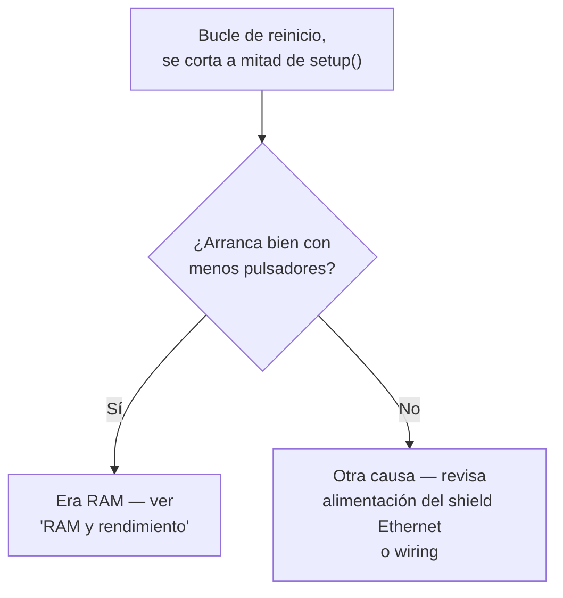

# Solución de problemas

## "El Serial Monitor muestra basura / letras repetidas sin parar"

**Síntoma**: el Serial Monitor imprime caracteres sueltos, un carácter
repetido en bucle, o texto que no parece corresponder a los
`Serial.println()` del código.

**Causa casi siempre**: el baudrate del Serial Monitor no coincide con
`Serial.begin(9600)` del `.ino`.

**Solución**: cambia el selector de baudrate del Serial Monitor a
**9600**. Todos los `.ino` de este proyecto usan ese valor.

!!! tip "No confundir con un reinicio en bucle real"
    Si tras poner el baudrate a 9600 el problema persiste y ves algo
    como `[boot] Mega...` repitiéndose desde el principio una y otra
    vez, entonces sí es un reinicio en bucle real — sigue leyendo.

## "La placa se reinicia en bucle nada más arrancar"

**Síntoma**: el log de `[boot] ...` empieza a imprimirse, pero nunca
llega a `[boot] iniciando Ethernet...` — se corta a mitad y vuelve a
empezar desde el principio, una y otra vez.

**Causa más probable: agotamiento de RAM.** Con muchos pulsadores
configurados, el programa se queda sin SRAM antes de terminar
`setup()`, lo que provoca un comportamiento indefinido (a menudo un
reinicio).

**Cómo confirmarlo**: reduce temporalmente `PINES_BOTONES[]` en
`board_config_a.h`/`board_config_b.h` a la mitad de pulsadores y
vuelve a flashear. Si arranca bien, era RAM — ver
[RAM y rendimiento](ram.md) para medir el límite real de tu
configuración.

**Otras causas posibles** (menos frecuentes):

- **Brownout del shield Ethernet**: si la placa está alimentada solo
  por USB (sin alimentación externa), el pico de corriente al
  inicializar el shield puede provocar un brownout reset. Prueba con
  alimentación externa por el conector barrel jack.

## "No compila: `too many initializers for '...[0]'`"

**Causa**: un array declarado con `[N] = {0}` (inicializador
explícito) donde `N` puede ser 0 — por ejemplo,
`PINES_PERSIANAS[] = {}` en `mega_dispositivos` combinado con un
array `algo[NUM_PERSIANAS] = {0}` en otro sitio del código.

**Ya corregido**: este bug se solucionó en la versión 1.6.3 de
`mega_dispositivos` quitando los inicializadores explícitos
innecesarios en arrays globales (que ya se inicializan a cero por
defecto en C++). Si ves este error, asegúrate de estar en una versión
posterior a la 1.6.3 — ver [Changelog](changelog.md).

## "Compilación falla en `mega_pulsadores`: `no matching function for call to 'OneButton::attachClick(...)'`"

**Causa**: versión antigua del `.ino` que intentaba usar lambdas con
captura (`[idx](){...}`) como callback de `OneButton`. Esa firma no
convierte a `callbackFunction` (function pointer puro sin captura), y
algunas instalaciones de la librería `OneButton` no exponen la
sobrecarga que sí acepta lambdas con captura.

**Ya corregido**: desde la versión 1.6.3, el código usa la sobrecarga
`parameterizedCallbackFunction` de `OneButton` (funciones sin captura
que reciben el índice del pulsador como `void*`). Actualiza a una
versión posterior.

## "Un blueprint dejó de dispararse sin ningún error"

**Causa casi siempre**: el trigger que ese blueprint espera ya no
existe — bien porque se desactivó con un `HABILITAR_*` en el `.ino`,
bien porque el pulsador está en una unidad
`mega_pulsadores_low_ram` que no soporta ese evento (triple, cuádruple
o quíntuple).

**Cómo diagnosticarlo**: los blueprints que dependen de eventos
específicos son:

| Blueprint | Eventos que necesita |
|---|---|
| `persiana_pulsador_completo.yaml` | corta, doble, triple, cuádruple, quíntuple, larga, fin de larga (los 7) |
| `luz_pulsador.yaml` | corta, doble, larga |
| `persiana_pulsador.yaml` | larga, fin de larga |
| `luz_zigbee_respaldo.yaml` | corta |

Revisa la tabla de compatibilidad completa en la
[guía de decisión](../firmware/decision.md).

## "Cambié el firmware de una unidad y las automatizaciones ya existentes dejaron de funcionar"

**Causa**: cambiar entre `mega_pulsadores`/`mega_pulsadores_low_ram`,
o cambiar el subtype format (`boton_NN` → `pNN`, versión 1.7.1), hace
que el "Subtype del botón" guardado en una automatización ya no
coincida con lo que el firmware envía ahora.

**Solución**: vuelve a abrir cada automatización afectada y
re-selecciona el trigger desde la UI (Añadir disparador → Device →
elegir el evento) para que capture el subtype/formato actual.
