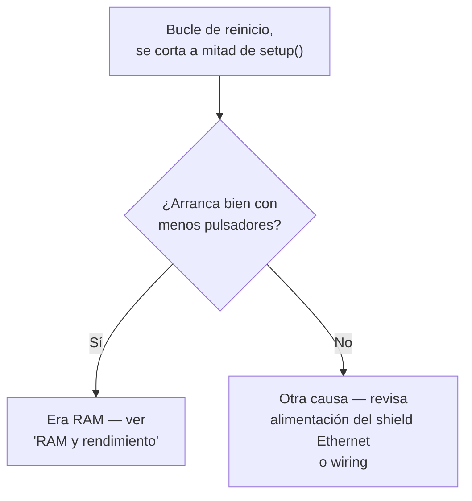

# Solución de problemas

## "El Serial Monitor muestra basura / letras repetidas sin parar"

**Síntoma**: el Serial Monitor imprime caracteres sueltos, un carácter
repetido en bucle, o texto que no parece corresponder a los
`Serial.println()` del código.

**Causa casi siempre**: el baudrate del Serial Monitor no coincide con
`Serial.begin(9600)` del `.ino`.

**Solución**: cambia el selector de baudrate del Serial Monitor a
**9600**. Todos los `.ino` de este proyecto usan ese valor.

!!! tip "No confundir con un reinicio en bucle real"
    Si tras poner el baudrate a 9600 el problema persiste y ves algo
    como `[boot] Mega...` repitiéndose desde el principio una y otra
    vez, entonces sí es un reinicio en bucle real — sigue leyendo.

## "La placa se reinicia en bucle nada más arrancar"

**Síntoma**: el log de `[boot] ...` empieza a imprimirse, pero nunca
llega a `[boot] iniciando Ethernet...` — se corta a mitad y vuelve a
empezar desde el principio, una y otra vez.

**Causa más probable: agotamiento de RAM.** Con muchos pulsadores
configurados, el programa se queda sin SRAM antes de terminar
`setup()`, lo que provoca un comportamiento indefinido (a menudo un
reinicio).

**Cómo confirmarlo**: reduce temporalmente `PINES_BOTONES[]` en
`board_config_a.h`/`board_config_b.h` a la mitad de pulsadores y
vuelve a flashear. Si arranca bien, era RAM — ver
[RAM y rendimiento](ram.md) para medir el límite real de tu
configuración.



**Otras causas posibles** (menos frecuentes):

- **Brownout del shield Ethernet**: si la placa está alimentada solo
  por USB (sin alimentación externa), el pico de corriente al
  inicializar el shield puede provocar un brownout reset. Prueba con
  alimentación externa por el conector barrel jack.

## "No compila: `too many initializers for '...[0]'`"

**Causa**: un array declarado con `[N] = {0}` (inicializador
explícito) donde `N` puede ser 0 — por ejemplo,
`PINES_PERSIANAS[] = {}` en `mega_dispositivos` combinado con un
array `algo[NUM_PERSIANAS] = {0}` en otro sitio del código.

**Ya corregido**: este bug se solucionó en la versión 1.6.3 de
`mega_dispositivos` quitando los inicializadores explícitos
innecesarios en arrays globales (que ya se inicializan a cero por
defecto en C++). Si ves este error, asegúrate de estar en una versión
posterior a la 1.6.3 — ver [Changelog](changelog.md).

## "Compilación falla en `mega_pulsadores`: `no matching function for call to 'OneButton::attachClick(...)'`"

**Causa**: versión antigua del `.ino` que intentaba usar lambdas con
captura (`[idx](){...}`) como callback de `OneButton`. Esa firma no
convierte a `callbackFunction` (function pointer puro sin captura), y
algunas instalaciones de la librería `OneButton` no exponen la
sobrecarga que sí acepta lambdas con captura.

**Ya corregido**: desde la versión 1.6.3, el código usa la sobrecarga
`parameterizedCallbackFunction` de `OneButton` (funciones sin captura
que reciben el índice del pulsador como `void*`). Actualiza a una
versión posterior.

## "En HA no veo los pulsadores como trigger de corta/doble/larga"

Caso real, diagnosticado a fondo el 2026-09-17. Tiene **tres causas
posibles** y conviene descartarlas en este orden, porque la primera no
es un bug.

### 1. Estás mirando donde no aparecen (lo más habitual)

Un `HADeviceTrigger` **no es una entidad**. No sale en Ajustes →
Entidades, ni en la sección *Controls* de la vista del dispositivo, ni
en *Activity*. Su única manifestación en toda la UI es el desplegable
de disparadores al crear una automatización.

Y ahí hay que llegar por la ruta correcta:

!!! tip "Ruta correcta en el editor de automatizaciones"
    **Añadir disparador → pestaña "By type" → Device →** elegir el
    dispositivo.

    La pestaña **"By target"** solo ofrece disparadores de *entidad*, y
    por esa vía lo único que sale es **"Button pressed"** — que es el
    `HAButton` virtual, un `button` cuyo único disparador posible es
    "pulsado". Por muchos objetivos que le añadas, nunca dará
    corta/doble/larga.

    Tampoco sirve **desplegar** el dispositivo con la flecha y elegir
    uno de los `p22`/`p23` de dentro: eso son sus entidades hijas (los
    botones virtuales), no el dispositivo.

### 2. Entidades fantasma de un flasheo anterior

El discovery MQTT se publica **retenido**: el broker lo conserva. Si la
unidad estuvo flasheada antes con más pines (o distintos), esas
entidades **siguen en HA** aunque el firmware actual ya no las anuncie.

Síntoma: HA muestra más pulsadores de los que dice
`[debug] NUM_PULSADORES=N`. En el caso real, 23 botones en la UI contra
16 en el firmware — los pines sobrantes estaban comentados en
`board_config_a.h`.

Arreglo: **Ajustes → Dispositivos y servicios → MQTT →** el dispositivo
**→ Eliminar**, y reiniciar la placa para que republique solo los
reales.

### 3. El buffer MQTT: `setBufferSize()` falló en silencio

Esta es la causa de verdad, y es doblemente traicionera.

El payload de discovery de un `device_automation` son unos **~280
bytes** (~210 de JSON + ~60 de topic + cabeceras), por encima de los
**256 por defecto** de PubSubClient. `HABaseDeviceType::publishConfig()`
publica con `beginPublish(topic, dataLength, true)`, que devuelve
`false` **sin ningún error en Serial** si no cabe.

!!! danger "Por qué los eventos funcionan pero el dispositivo no aparece"
    El payload de un **evento** (`trigger()`) son unos pocos bytes y
    cabe de sobra en 256. El del **discovery** no.

    Resultado: el Serial imprime `[boton] p22 -> corta` con toda
    normalidad, el pulsador se detecta perfectamente... y HA no reacciona,
    porque nunca recibió el config que le dice que ese trigger existe.
    Un evento de un trigger no registrado se descarta.

    El `HAButton` virtual sí se veía porque su discovery es más pequeño
    y cabía en 256.

Y la segunda trampa: **`setBufferSize()` puede fallar aunque parezca
haber RAM**. Hace un `realloc`, que necesita un bloque **contiguo**;
llamado después de crear los ~120 objetos del bucle de pulsadores, el
heap está troceado y no hay hueco seguido. Devuelve `false` en silencio
y PubSubClient se queda con los 256 de siempre.

Desde la **1.8.7** el firmware lo delata:

```
[debug] setBufferSize(512) -> OK
[debug] setBufferSize(512) -> FALLO (sigue en 256!)   ← el bug
```

Arreglado en la **1.8.5** moviendo la llamada al principio de
`setup()`, antes de crear ninguna entidad. Ver
[RAM y rendimiento](ram.md) para el detalle de la fragmentación.

### Cómo comprobar qué publica la placa de verdad

Sin tocar el firmware, desde HA: **Ajustes → Dispositivos y servicios →
MQTT → Configurar**, y en **"Escuchar un topic"**:

```
homeassistant/device_automation/#
```

**Start listening** y reiniciar la placa. Deberían aparecer 4 mensajes
por pulsador (`button_short_press`, `button_double_press`,
`button_long_press`, `button_long_release`).

!!! warning "`Retain: false` en esta herramienta NO es un síntoma"
    Un mensaje que llega **en vivo** (publicado en ese instante) se
    entrega siempre con el flag retain a `false`, aunque el broker lo
    esté almacenando. El flag solo viaja como `true` en los mensajes
    que el broker **reenvía desde su almacén al suscribirse**.

    Para ver el estado real: **Stop listening** y **Start listening** de
    nuevo, sin reiniciar la placa. Si los mensajes reaparecen con
    `Retain: true`, están correctamente retenidos y el problema no es
    del broker ni del firmware — es de registro en HA.

## "Un blueprint dejó de dispararse sin ningún error"

**Causa casi siempre**: el trigger que ese blueprint espera ya no
existe — bien porque se desactivó con un `HABILITAR_*` en el `.ino`,
bien porque el pulsador está en una unidad
`mega_pulsadores_low_ram` que no soporta ese evento (triple, cuádruple
o quíntuple).

**Cómo diagnosticarlo**: los blueprints que dependen de eventos
específicos son:

| Blueprint | Eventos que necesita |
|---|---|
| `persiana_pulsador_completo` | corta, doble, triple, cuádruple, quíntuple, larga, fin de larga (los 7) |
| `luz_pulsador` | corta, doble, larga |
| `persiana_pulsador` | larga, fin de larga |
| `luz_zigbee_respaldo` | corta |

Revisa la tabla de compatibilidad completa en la
[guía de decisión](../firmware/decision.md).

## "Cambié el firmware de una unidad y las automatizaciones ya existentes dejaron de funcionar"

**Causa**: cambiar entre `mega_pulsadores`/`mega_pulsadores_low_ram`,
o cambiar el subtype format (`boton_NN` → `pNN`, versión 1.7.1), hace
que el "Subtype del botón" guardado en una automatización ya no
coincida con lo que el firmware envía ahora.

**Solución**: vuelve a abrir cada automatización afectada y
re-selecciona el trigger desde la UI (Añadir disparador → Device →
elegir el evento) para que capture el subtype/formato actual.
